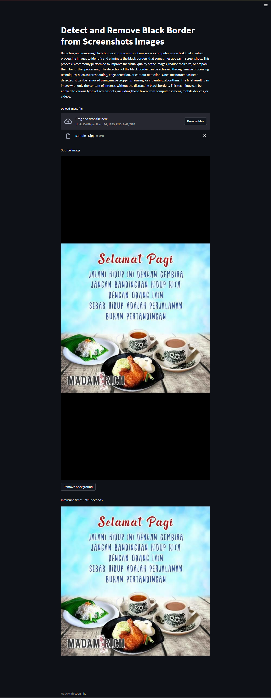

# Background Removal



## Description

Detecting and removing black borders from screenshot images is a computer vision task that involves processing images to identify and eliminate the black borders that sometimes appear in screenshots. This process is commonly performed to improve the visual quality of the images, reduce their size, or prepare them for further processing. The detection of the black border can be achieved through image processing techniques, such as thresholding, edge detection, or contour detection. Once the border has been detected, it can be removed using image cropping, resizing, or inpainting algorithms. The final result is an image with only the content of interest, without the distracting black borders. This technique can be applied to various types of screenshots, including those taken from computer screens, mobile devices, or videos.

## Installation

Please use python version 3.8.10 or above

```bash
git clone https://github.com/hafidh561/background-removal.git
pip3 install -r requirements.txt
```

## Usage

```bash
streamlit run app.py
```

## License

[MIT LICENSE](./LICENSE)

© Developed by [hafidh561](https://github.com/hafidh561)
